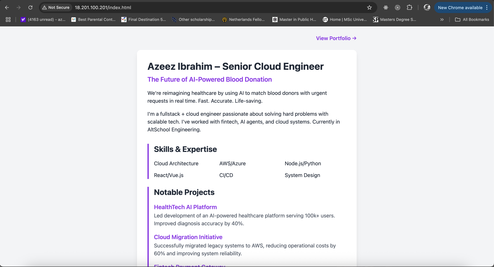

# AltSchool Cloud Project – Landing Page

## ✅ Overview
This project provisions an Ubuntu EC2 instance, installs NGINX, and deploys a dynamic landing page for an AI-powered health startup idea.

## 🔧 Technologies Used
- AWS EC2 (Ubuntu)
- NGINX (with optional Node.js reverse proxy)
- TailwindCSS
- HTML

## ✅ Objectives Completed

- [x] Provisioned Ubuntu server on AWS EC2
- [x] Installed and configured NGINX
- [x] Set up a Node.js application
- [x] Configured NGINX as a reverse proxy to the Node.js app
- [x] Created and deployed a TailwindCSS landing page
- [x] Opened HTTP (80), HTTPS (443), and SSH (22) in security group

## 🔧 Detailed Setup Instructions

### 1. 🖥️ Provision EC2 Instance

- Platform: AWS EC2
- OS: Ubuntu Server 20.04 LTS
- Instance Type: `t2.micro` (Free tier)
- Key Pair: Created and downloaded (`second-semester.pem`)
- Security Group Configuration:
  - HTTP (port 80): `0.0.0.0/0`
  - HTTPS (port 443): `0.0.0.0/0`
  - SSH (port 22): `0.0.0.0/0` 
- SSH into instance:
  ```bash
  chmod 400 aladin.pem
  ssh -i aladin.pem ubuntu@18.201.100.201
  ```

### 2. 🚀 Install and Configure NGINX

```bash
# Update package list and install NGINX
sudo apt update
sudo apt install nginx -y

# Start NGINX and enable on boot
sudo systemctl start nginx
sudo systemctl enable nginx

# Verify NGINX is running
sudo systemctl status nginx
```

### 3. 📦 Set Up Node.js Application

```bash
# Install Node.js and npm
curl -fsSL https://deb.nodesource.com/setup_16.x | sudo -E bash -
sudo apt install -y nodejs

# Verify installation
node --version
npm --version

# Create project directory
mkdir ~/public
cd ~/public

# Initialize Node.js project
npm init -y

# Install dependencies
npm install express
```

### 4. 🔄 Configure NGINX as Reverse Proxy

```bash
# Create NGINX server block configuration
sudo nano /etc/nginx/sites-available/default
```

Add the following configuration:
```nginx
server {
    listen 80;
    server_name _;

    location / {
        proxy_pass http://localhost:3000;
        proxy_http_version 1.1;
        proxy_set_header Upgrade $http_upgrade;
        proxy_set_header Connection 'upgrade';
        proxy_set_header Host $host;
        proxy_cache_bypass $http_upgrade;
    }
}
```

```bash
# Create symlink to enable site
sudo ln -s /etc/nginx/sites-available/default /etc/nginx/sites-enabled/

# Test NGINX configuration
sudo nginx -t

# Reload NGINX
sudo systemctl reload nginx
```

### 5. 🎨 Deploy TailwindCSS Landing Page

```bash
# Create project directory structure
mkdir -p public
cd public

# Create and edit HTML file
nano index.html

# Add TailwindCSS via CDN in index.html
<script src="https://cdn.tailwindcss.com"></script>

# Copy static files to NGINX serve directory
sudo cp -r * /var/www/public/
```

### 6. 🔒 Security Group Configuration

1. Navigate to EC2 Dashboard > Security Groups
2. Select the security group attached to your instance
3. Edit inbound rules:
   - Add rule: HTTP (80) from anywhere `0.0.0.0/0`
   - Add rule: HTTPS (443) from anywhere `0.0.0.0/0`
   - Add rule: SSH (22) from your IP
4. Save rules


## 🌐 Live URL
http://18.201.100.201/

## 💻 Screenshot



